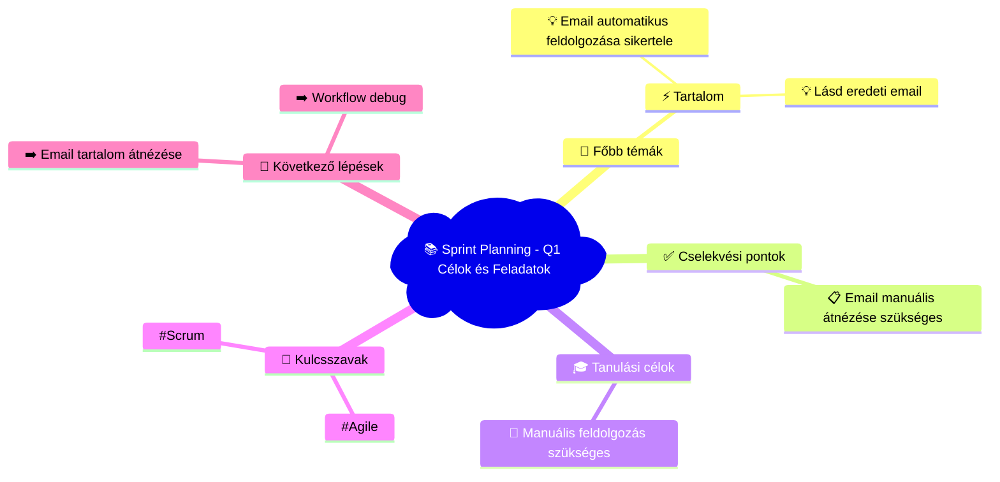

# 📧 Agile Training Mindmap
**Létrehozva:** 2025. 10. 02. 16:06:48  
**Email tárgy:** Sprint Planning - Q1 Célok és Feladatok  
**Feladó:** [object Object]  

---

## 🧠 Vizuális Mindmap

---

## 📝 Részletes Összegzés

### 💡 Összefoglalás:
Az email automatikus feldolgozása nem sikerült. A Claude API válasz nem volt valid JSON formátumban.

### 🎯 Fő tanulási területek:
**Tartalom** (medium prioritás):
- Email automatikus feldolgozása sikertelen
- Lásd eredeti email

### ✅ Azonnal elvégzendő feladatok:
1. Email manuális átnézése szükséges

### 🎓 Tanulási célkitűzések:
- Manuális feldolgozás szükséges

### 📈 Következő lépések:
- Email tartalom átnézése
- Workflow debug

---

## 🏷️ Meta adatok
- **Feldolgozás ideje:** 2025. 10. 02. 16:06:48
- **AI Model:** Claude Sonnet 4
- **Kulcsszavak:** Agile, Scrum
- **Email ID:** 199a3b9652e2ecd5

---
*🤖 Automatikusan generálta: n8n + Claude (Anthropic) + Mermaid.js*
