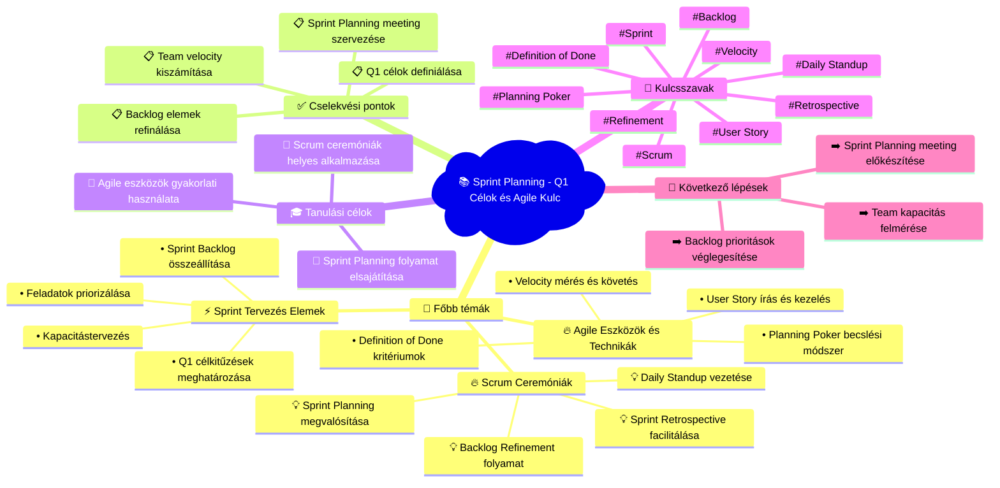

# 📧 Agile Training Mindmap
**Létrehozva:** 2025. 10. 02. 19:11:34  
**Email tárgy:** Sprint Planning - Q1 Célok és Feladatok  
**Feladó:** [object Object]  

---

## 🧠 Vizuális Mindmap

---

## 📝 Részletes Összegzés

### 💡 Összefoglalás:
Az email Sprint Planning témájú, Q1 célokra fókuszálva. Tartalmazza a legfontosabb Agile/Scrum kulcsszavakat és ceremóniákat, amelyek alapvető elemei a sikeres sprint tervezésnek.

### 🎯 Fő tanulási területek:
**Scrum Ceremóniák** (high prioritás):
- Sprint Planning megvalósítása
- Daily Standup vezetése
- Sprint Retrospective facilitálása
- Backlog Refinement folyamat

**Agile Eszközök és Technikák** (high prioritás):
- Planning Poker becslési módszer
- User Story írás és kezelés
- Velocity mérés és követés
- Definition of Done kritériumok

**Sprint Tervezés Elemek** (medium prioritás):
- Q1 célkitűzések meghatározása
- Sprint Backlog összeállítása
- Kapacitástervezés
- Feladatok priorizálása

### ✅ Azonnal elvégzendő feladatok:
1. Sprint Planning meeting szervezése
2. Backlog elemek refinálása
3. Team velocity kiszámítása
4. Q1 célok definiálása

### 🎓 Tanulási célkitűzések:
- Scrum ceremóniák helyes alkalmazása
- Sprint Planning folyamat elsajátítása
- Agile eszközök gyakorlati használata

### 📈 Következő lépések:
- Sprint Planning meeting előkészítése
- Team kapacitás felmérése
- Backlog prioritások véglegesítése

---

## 🏷️ Meta adatok
- **Feldolgozás ideje:** 2025. 10. 02. 19:11:34
- **AI Model:** Claude Sonnet 4
- **Kulcsszavak:** Scrum, Sprint, Backlog, Retrospective, Daily Standup, User Story, Velocity, Planning Poker, Definition of Done, Refinement
- **Email ID:** 199a3b9652e2ecd5

---
*🤖 Automatikusan generálta: n8n + Claude (Anthropic) + Mermaid.js*
