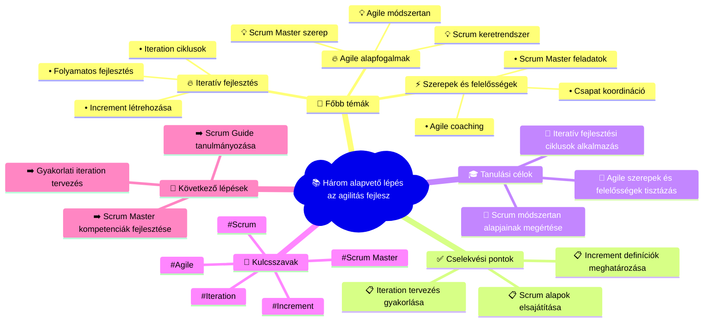

# 📧 Agile Training Mindmap
**Létrehozva:** 2025. 10. 03. 6:23:20  
**Email tárgy:** The only three things you must do to improve agility  
**Feladó:** mike@mountaingoatsoftware.com  

---

## 🧠 Vizuális Mindmap

---

## 📝 Részletes Összegzés

### 💡 Összefoglalás:
Az email az agilitás fejlesztésének három kulcsfontosságú területére fókuszál: Scrum keretrendszer, iteratív fejlesztési folyamatok és a Scrum Master szerepének megértése.

### 🎯 Fő tanulási területek:
**Agile alapfogalmak** (high prioritás):
- Scrum keretrendszer
- Agile módszertan
- Scrum Master szerep

**Iteratív fejlesztés** (high prioritás):
- Iteration ciklusok
- Increment létrehozása
- Folyamatos fejlesztés

**Szerepek és felelősségek** (medium prioritás):
- Scrum Master feladatok
- Csapat koordináció
- Agile coaching

### ✅ Azonnal elvégzendő feladatok:
1. Scrum alapok elsajátítása
2. Iteration tervezés gyakorlása
3. Increment definíciók meghatározása

### 🎓 Tanulási célkitűzések:
- Scrum módszertan alapjainak megértése
- Iteratív fejlesztési ciklusok alkalmazása
- Agile szerepek és felelősségek tisztázása

### 📈 Következő lépések:
- Scrum Guide tanulmányozása
- Gyakorlati iteration tervezés
- Scrum Master kompetenciák fejlesztése

---

## 🏷️ Meta adatok
- **Feldolgozás ideje:** 2025. 10. 03. 6:23:20
- **AI Model:** Claude Sonnet 4
- **Kulcsszavak:** Scrum, Agile, Scrum Master, Iteration, Increment
- **Email ID:** 199a5a78cd7f261a

---
*🤖 Automatikusan generálta: n8n + Claude (Anthropic) + Mermaid.js*
