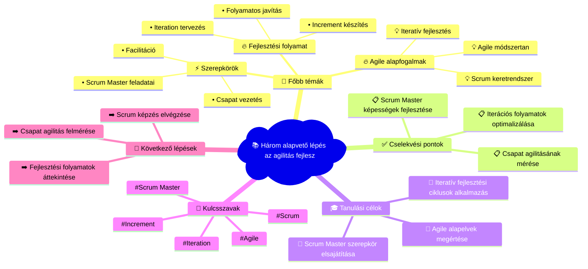

# 📧 Agile Training Mindmap
**Létrehozva:** 2025. 10. 03. 6:23:58  
**Email tárgy:** The only three things you must do to improve agility  
**Feladó:** mike@mountaingoatsoftware.com  

---

## 🧠 Vizuális Mindmap

---

## 📝 Részletes Összegzés

### 💡 Összefoglalás:
Az email az agilitás fejlesztésének három kulcsfontosságú területét mutatja be. A Scrum keretrendszer és az iteratív fejlesztés alapjaira fókuszál.

### 🎯 Fő tanulási területek:
**Agile alapfogalmak** (high prioritás):
- Scrum keretrendszer
- Agile módszertan
- Iteratív fejlesztés

**Fejlesztési folyamat** (high prioritás):
- Iteration tervezés
- Increment készítés
- Folyamatos javítás

**Szerepkörök** (medium prioritás):
- Scrum Master feladatai
- Csapat vezetés
- Facilitáció

### ✅ Azonnal elvégzendő feladatok:
1. Scrum Master képességek fejlesztése
2. Iterációs folyamatok optimalizálása
3. Csapat agilitásának mérése

### 🎓 Tanulási célkitűzések:
- Agile alapelvek megértése
- Scrum Master szerepkör elsajátítása
- Iteratív fejlesztési ciklusok alkalmazása

### 📈 Következő lépések:
- Scrum képzés elvégzése
- Csapat agilitás felmérése
- Fejlesztési folyamatok áttekintése

---

## 🏷️ Meta adatok
- **Feldolgozás ideje:** 2025. 10. 03. 6:23:58
- **AI Model:** Claude Sonnet 4
- **Kulcsszavak:** Scrum, Agile, Scrum Master, Iteration, Increment
- **Email ID:** 199a5a78cd7f261a

---
*🤖 Automatikusan generálta: n8n + Claude (Anthropic) + Mermaid.js*
