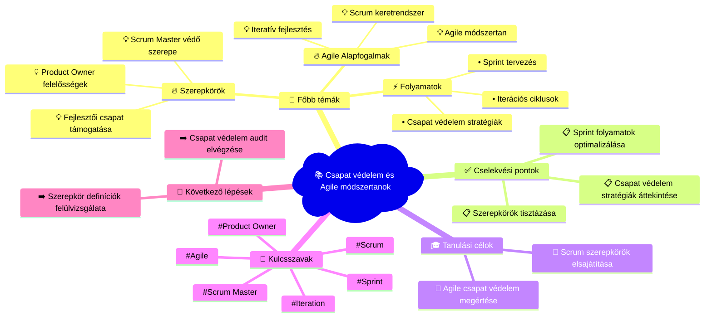

# 📧 Agile Training Mindmap
**Létrehozva:** 2025. 10. 03. 6:34:31  
**Email tárgy:** Are You Protecting Your Team Against the Right Thing?  
**Feladó:** kefir_03@yahoo.com  

---

## 🧠 Vizuális Mindmap

---

## 📝 Részletes Összegzés

### 💡 Összefoglalás:
Az email a csapat védelem fontosságát hangsúlyozza Agile környezetben. A Scrum Master és Product Owner szerepek kulcsfontosságúak a megfelelő védelem biztosításában.

### 🎯 Fő tanulási területek:
**Agile Alapfogalmak** (high prioritás):
- Scrum keretrendszer
- Agile módszertan
- Iteratív fejlesztés

**Szerepkörök** (high prioritás):
- Product Owner felelősségek
- Scrum Master védő szerepe
- Fejlesztői csapat támogatása

**Folyamatok** (medium prioritás):
- Sprint tervezés
- Iterációs ciklusok
- Csapat védelem stratégiák

### ✅ Azonnal elvégzendő feladatok:
1. Csapat védelem stratégiák áttekintése
2. Szerepkörök tisztázása
3. Sprint folyamatok optimalizálása

### 🎓 Tanulási célkitűzések:
- Agile csapat védelem megértése
- Scrum szerepkörök elsajátítása

### 📈 Következő lépések:
- Csapat védelem audit elvégzése
- Szerepkör definíciók felülvizsgálata

---

## 🏷️ Meta adatok
- **Feldolgozás ideje:** 2025. 10. 03. 6:34:31
- **AI Model:** Claude Sonnet 4
- **Kulcsszavak:** Scrum, Agile, Sprint, Product Owner, Scrum Master, Iteration
- **Email ID:** 199a8c6a391b471c

---
*🤖 Automatikusan generálta: n8n + Claude (Anthropic) + Mermaid.js*
